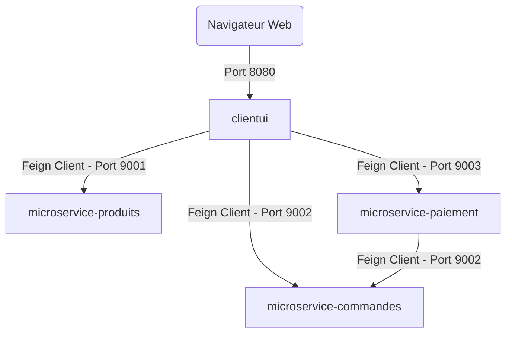

# Mcommerce Microservices - Spring Cloud OpenFeign

Ce projet implémente une plateforme d'e-commerce simplifiée (Mcommerce) basée sur une architecture de **microservices** développés avec **Spring Boot** et **Spring Cloud**. Il met en évidence la communication inter-services déclarative et simplifiée à l'aide de **Spring Cloud OpenFeign**.

---

## 🏗️ Architecture du Système

Le projet est divisé en **4 modules** (microservices) autonomes qui collaborent ensemble :



### 1. 🖥️ `clientui` (Port `8080`)
* **Rôle** : L'interface utilisateur Web construite avec Thymeleaf et Bootstrap.
* **Fonctionnement** : Il ne possède pas de base de données propre. Il consomme les APIs des autres microservices via des clients OpenFeign (`MicroserviceProduitsProxy`, `MicroserviceCommandeProxy`, `MicroservicePaiementProxy`) pour construire et afficher les pages HTML dynamiquement.

### 2. 📦 `microservice-produits` (Port `9001`)
* **Rôle** : Gère le catalogue de produits (lecture, détails).
* **Technologie** : Spring Data JPA, Base de données H2 (en mémoire), données initialisées automatiquement via `data.sql`.

### 3. 🛒 `microservice-commandes` (Port `9002`)
* **Rôle** : Gère le cycle de vie des commandes clients.
* **Technologie** : Spring Data JPA, Base de données H2.

### 4. 💳 `microservice-paiement` (Port `9003`)
* **Rôle** : Gère le traitement des paiements associés aux commandes. Une fois le paiement validé, il communique avec le microservice des commandes pour mettre à jour le statut de la commande.
* **Technologie** : Spring Data JPA, Base de données H2.

---

## 🛠️ Technologies Utilisées
* **Java 17 / Java 21**
* **Spring Boot 2.6.1**
* **Spring Cloud OpenFeign**
* **Thymeleaf & Bootstrap** (pour l'interface client)
* **Base de données H2** (en mémoire)
* **Maven Wrapper** (inclus dans chaque projet)

---

## 🚀 Installation et Démarrage

### Prérequis
* Java JDK 17 ou supérieur installé sur la machine.
* Git.

### Étape 1 : Cloner le projet
```bash
git clone <URL_DE_VOTRE_DEPOT_GITHUB>
cd TP7_Feign_codesource
```

### Étape 2 : Compiler les microservices
Vous pouvez compiler tous les services à l'aide du wrapper Maven inclus :

**Sur Windows (PowerShell) :**
```powershell
# Compiler microservice par microservice
cd microservice-produits; .\mvnw.cmd clean package -DskipTests; cd ..
cd microservice-commandes; .\mvnw.cmd clean package -DskipTests; cd ..
cd microservice-paiement; .\mvnw.cmd clean package -DskipTests; cd ..
cd clientui; .\mvnw.cmd clean package -DskipTests; cd ..
```

**Sur Linux / macOS :**
```bash
# Compiler microservice par microservice
cd microservice-produits && ./mvnw clean package -DskipTests && cd ..
cd microservice-commandes && ./mvnw clean package -DskipTests && cd ..
cd microservice-paiement && ./mvnw clean package -DskipTests && cd ..
cd clientui && ./mvnw clean package -DskipTests && cd ..
```

### Étape 3 : Démarrer les microservices
Pour que le système fonctionne correctement, vous devez démarrer **les 4 microservices**. Lancez chaque commande dans un terminal séparé :

```bash
# Dans le dossier de chaque microservice :
./mvnw spring-boot:run   # (ou .\mvnw.cmd spring-boot:run sous Windows)
```

---

## 🔍 Validation du Fonctionnement

Une fois tous les services démarrés, vous pouvez valider leur état à l'aide des URLs suivantes :

| Service | Rôle | URL d'accès |
| :--- | :--- | :--- |
| **Client UI** | Portail client Web | [http://localhost:8080/](http://localhost:8080/) |
| **Produits API** | Liste brute des produits | [http://localhost:9001/Produits](http://localhost:9001/Produits) |
| **Commandes API** | API des commandes | [http://localhost:9002/Commandes](http://localhost:9002/Commandes) |
| **Paiements API** | API des paiements | [http://localhost:9003/Paiement](http://localhost:9003/Paiement) |

---

## 📈 Exemples de Scénarios
1. **Affichage du catalogue** : L'utilisateur accède à `http://localhost:8080/`. L'interface `clientui` effectue une requête HTTP GET vers `http://localhost:9001/Produits` via OpenFeign pour récupérer la liste des produits et l'afficher.
2. **Détail du produit** : Cliquer sur un produit appelle le proxy Produits pour récupérer les détails à l'adresse `http://localhost:9001/Produits/{id}`.
