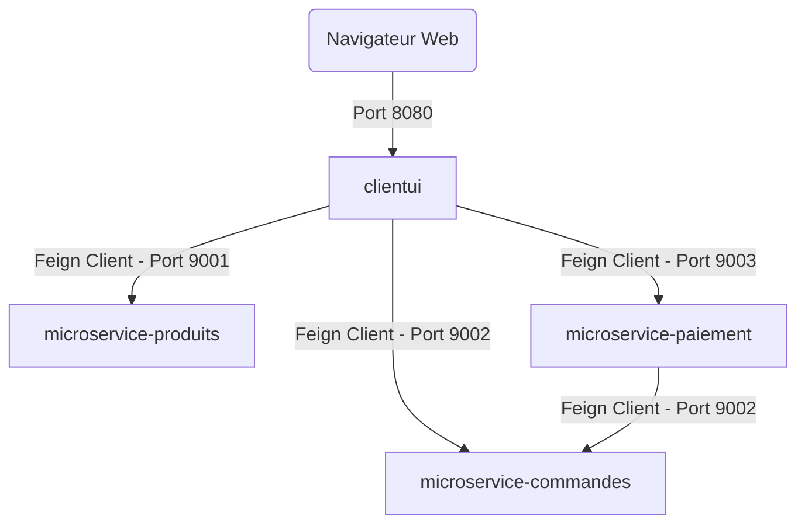
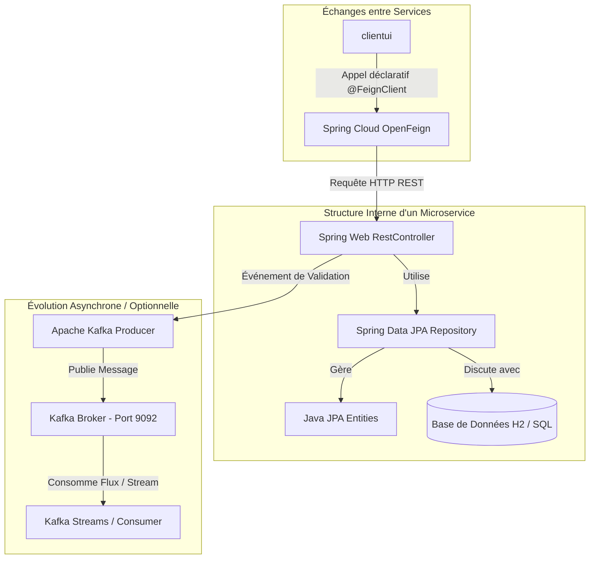

# Mcommerce Microservices - Spring Cloud OpenFeign

Ce projet implémente une plateforme d'e-commerce simplifiée (Mcommerce) basée sur une architecture de **microservices** développés avec **Spring Boot** et **Spring Cloud**. Il met en évidence la communication inter-services déclarative et simplifiée à l'aide de **Spring Cloud OpenFeign**.

---

## 📝 Énoncé du Devoir
Le sujet complet du devoir est disponible dans le dépôt sous le fichier [Devoir_Module_JEE(2)_MicroServices_v1.pdf](Devoir_Module_JEE(2)_MicroServices_v1.pdf).

---

## 🏗️ Architecture du Système

Le projet est divisé en **4 modules** (microservices) autonomes qui collaborent ensemble :



### 1. 🖥️ `clientui` (Port `8080`)
* **Rôle** : L'interface utilisateur Web construite avec Thymeleaf et Bootstrap.
* **Fonctionnement** : Il ne possède pas de base de données propre. Il consomme les APIs des autres microservices via des clients OpenFeign (`MicroserviceProduitsProxy`, `MicroserviceCommandeProxy`, `MicroservicePaiementProxy`) pour construire et afficher les pages HTML dynamiquement.

### 2. 📦 `microservice-produits` (Port `9001`)
* **Rôle** : Gère le catalogue de produits (lecture, détails).
* **Technologie** : Spring Data JPA, Base de données H2 (en mémoire), données initialisées automatiquement via `data.sql`.

### 3. 🛒 `microservice-commandes` (Port `9002`)
* **Rôle** : Gère le cycle de vie des commandes clients.
* **Technologie** : Spring Data JPA, Base de données H2.

### 4. 💳 `microservice-paiement` (Port `9003`)
* **Rôle** : Gère le traitement des paiements associés aux commandes. Une fois le paiement validé, il communique avec le microservice des commandes pour mettre à jour le statut de la commande.
* **Technologie** : Spring Data JPA, Base de données H2.

---

## 🛠️ Technologies & Écosystème Spring Boot en Détail

Ce projet exploite la puissance de l'écosystème **Spring Boot** et **Spring Cloud** pour simplifier le développement et la persistance des données. Voici comment les différents composants s'articulent et s'intègrent :



### 1. ⚙️ Les Composants du Framework Spring Boot
Chaque microservice du projet est construit sur un socle Spring Boot standard, où les composants collaborent de la manière suivante :
* **Spring Web (MVC / REST)** : Gère l'exposition des routes HTTP (via `@RestController` et les annotations de mapping comme `@GetMapping`, `@PostMapping`). C'est le point d'entrée pour les appels externes et inter-services.
* **Spring Data JPA & Hibernate** : Abstrait la couche d'accès aux données. Hibernate sert d'implémentation de l'ORM (Object-Relational Mapping), tandis que Spring Data JPA fournit des repositories prêts à l'emploi (interfaces étendant `JpaRepository`) pour exécuter des requêtes SQL sans avoir à écrire de code boilerplate.
* **Base de données H2 (In-Memory)** : Une base de données relationnelle en mémoire très légère. Elle est créée au démarrage du microservice et détruite à l'arrêt. Elle est idéale pour le prototypage rapide. Dans `microservice-produits`, les données de démonstration sont insérées au démarrage via le script `data.sql`.

### 2. 🔗 La Communication Synchrone : Spring Cloud OpenFeign
Au lieu d'utiliser un client HTTP classique (comme `RestTemplate` ou `WebClient`) qui requiert d'écrire manuellement des URLs de requêtes et de parser les réponses, **OpenFeign** rend la communication déclarative :
* On définit une interface annotée `@FeignClient` avec l'URL du service cible (ex: `@FeignClient(name = "microservice-produits", url = "localhost:9001")`).
* On déclare les méthodes correspondantes avec les annotations Spring Web standards (comme `@GetMapping("/Produits")`).
* Au démarrage, Spring génère l'implémentation proxy sous le capot et gère automatiquement l'envoi de la requête HTTP synchrone, la sérialisation/désérialisation JSON en objets Java (Beans), et la gestion des exceptions.

### 3. 🔄 La Communication Asynchrone : Apache Kafka & Kafka Streams (Concept Événementiel)
Dans les architectures d'entreprise, la communication synchrone (HTTP/Feign) peut engendrer des couplages forts et des risques de pannes en cascade. C'est ici que s'intègre **Apache Kafka** (comme démontré dans le projet frère `kafka-streams` de votre espace de travail) :
* **Découplage événementiel** : Lorsqu'un paiement est validé par le `microservice-paiement`, au lieu d'appeler directement le `microservice-commandes` de manière synchrone, il peut publier un événement `PaiementValide` dans un **Broker Kafka (port 9092)**.
* **Consommation & Streaming** : Le `microservice-commandes` ou un outil d'analyse en temps réel (utilisant **Kafka Streams** ou un simple Consumer) écoute le flux de messages pour mettre à jour la commande ou générer des analytiques en temps réel, de façon totalement asynchrone et résiliente.

---

## 🚀 Installation et Démarrage

### Prérequis
* Java JDK 17 ou supérieur installé sur la machine.
* Git.

### Étape 1 : Cloner le projet
```bash
git clone <URL_DE_VOTRE_DEPOT_GITHUB>
cd TP7_Feign_codesource
```

### Étape 2 : Compiler les microservices
Vous pouvez compiler tous les services à l'aide du wrapper Maven inclus :

**Sur Windows (PowerShell) :**
```powershell
# Compiler microservice par microservice
cd microservice-produits; .\mvnw.cmd clean package -DskipTests; cd ..
cd microservice-commandes; .\mvnw.cmd clean package -DskipTests; cd ..
cd microservice-paiement; .\mvnw.cmd clean package -DskipTests; cd ..
cd clientui; .\mvnw.cmd clean package -DskipTests; cd ..
```

**Sur Linux / macOS :**
```bash
# Compiler microservice par microservice
cd microservice-produits && ./mvnw clean package -DskipTests && cd ..
cd microservice-commandes && ./mvnw clean package -DskipTests && cd ..
cd microservice-paiement && ./mvnw clean package -DskipTests && cd ..
cd clientui && ./mvnw clean package -DskipTests && cd ..
```

### Étape 3 : Démarrer les microservices
Pour que le système fonctionne correctement, vous devez démarrer **les 4 microservices**. Lancez chaque commande dans un terminal séparé :

```bash
# Dans le dossier de chaque microservice :
./mvnw spring-boot:run   # (ou .\mvnw.cmd spring-boot:run sous Windows)
```

---

## 🔍 Validation du Fonctionnement

Une fois tous les services démarrés, vous pouvez valider leur état à l'aide des URLs suivantes :

| Service | Rôle | URL d'accès |
| :--- | :--- | :--- |
| **Client UI** | Portail client Web | [http://localhost:8080/](http://localhost:8080/) |
| **Produits API** | Liste brute des produits | [http://localhost:9001/Produits](http://localhost:9001/Produits) |
| **Commandes API** | API des commandes | [http://localhost:9002/Commandes](http://localhost:9002/Commandes) |
| **Paiements API** | API des paiements | [http://localhost:9003/Paiement](http://localhost:9003/Paiement) |

---

## 📈 Exemples de Scénarios
1. **Affichage du catalogue** : L'utilisateur accède à `http://localhost:8080/`. L'interface `clientui` effectue une requête HTTP GET vers `http://localhost:9001/Produits` via OpenFeign pour récupérer la liste des produits et l'afficher.
2. **Détail du produit** : Cliquer sur un produit appelle le proxy Produits pour récupérer les détails à l'adresse `http://localhost:9001/Produits/{id}`.
